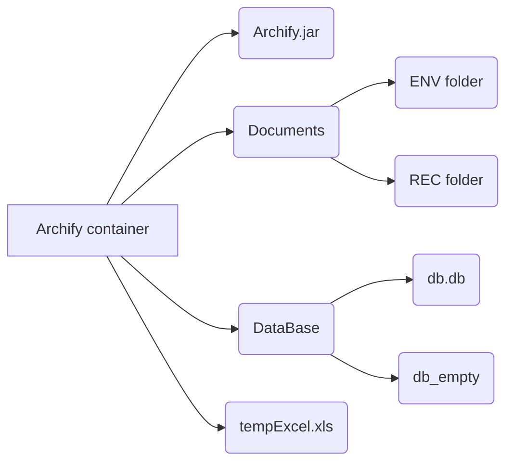

# Archify

Assalam alaykoum , [Archify](https://github.com/OussamaNahnah/Archify)  made by  [Oussama Nahnah](https://www.linkedin.com/in/oussamanahnah/), is software that allows you to manage your archive, transmit and receive documents, and perform advanced searches.It allows you to export your data as an Excel spreadsheet.  

## installation setup:
-  install [JDK 18]( https://www.oracle.com/java/technologies/javase/jdk18-archive-downloads.html)  (required).
-  download **Archify.zip** from [here](https://github.com/OussamaNahnah/Archify/releases), extract then copy it to a local destination (required).
-  install excel (recommended).
-  install [sqlite browser]( https://sqlitebrowser.org/dl/) if u want to see the database file  (advanced).

## architecture

- Archif folder : is the container of program.
- Archify.jar : is the excutible program.
- Documents folder : contain to other folder ENV folder for transmited document And REC folder for the received document.
- DataBase folder : contain db.db file wich is the sqlite3 database and db-empty.db file wich is an empty database used when starting over.

## Warning:
- Any changes made to the program container **archify** will have an impact on the program.
- If you want to  use the program again, create a copy of db_empty.db then rename it to db.db

 
## ِcontact us:
- **email:** oussamanh7@gmail.com 
- **phone:** +213696900164
- **lindekin:** https://www.linkedin.com/in/oussamanahnah/
- **fb:** https://www.facebook.com/osma0k/
# أرشيفي
السلام عليكم ، تم إعداد برنامج Archify بواسطة أسامة نحناح لأرشيف المستندات المرسلة والمستقبلة ، مع خصائص مثل عمليات البحث المتقدمة وتصدير قائمة EXEL.

## إعداد التثبيت:
- تثبيت jdk 18 (مطلوب)
- حمل ملف البرنامج  **Archify.zip** من [هنا](https://github.com/OussamaNahnah/Archify/releases) ،انقله إلى وجهة محلية ثم فك الضغط (مطلوب)
- تثبيت اكسل (موصى به)
- متصفح sqlite ادا كنت تريد تصفح ملف قاعدة البيانات (متقدم)

## هندسة معمارية

- Archif folder :
 مجلد الأرشيف: هو حاوية البرنامج
- Archify.jar :
 هو البرنامج القابل للتنفيذ
- Documents folder : 
 يحتوي على مجلد آخر مجلد ENV للمستند المرسل ومجلد REC لمستند المستقبل
- DataBase folder :
 يحتوي على ملف db.db الذي يمثل قاعدة بيانات sqlite3 و ملف db-empty.db الذي يعد قاعدة بيانات فارغة تُستخدم عند البدء من جديد.
## تحذير:
- أي تعديل في حاوية البرنامج "archify" سيؤثر على البرنامج
- إذا كنت تريد استخدام البرنامج مرة أخرى ، فقم بإنشاء نسخة من db_empty.db ثم أعد تسميته إلى db.db

## ِتواصل معنا:
- **email:** oussamanh7@gmail.com 
- **phone:** +213696900164
- **lindekin:** https://www.linkedin.com/in/oussamanahnah/
- **fb:** https://www.facebook.com/osma0k/.

