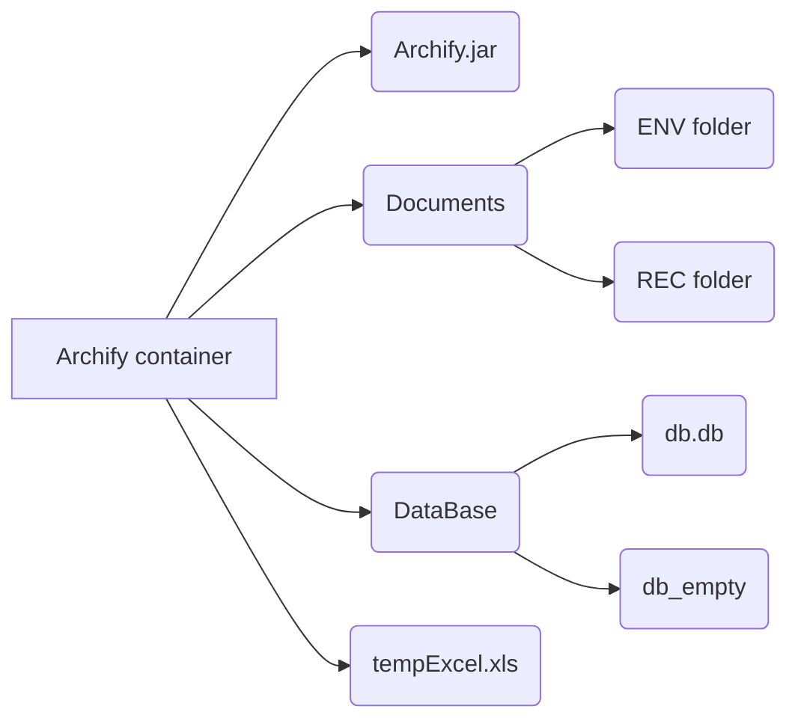

# Archify

Assalam alaykoum , **Archify** program is made by Oussama nahnah for archif sent and reseived documents , with feuters like vanced searchs and export EXEL list.

## requirements:
- JDK 18
- Exel

## installation setup:
-  install jdk 18 (requered)
-  install excel (recdemended)
-  copy the program folder **Archify** to local destination (requered)
-  sqlite browser (advanced)

## architecture

- Archif folder : is the container of program
- Archify.jar : is the excutible program
- Documents folder : contain to other folder ENV folder for sended document And REC folder for the receive document
- DataBase folder : contain db.db file wich is the sqlite3 database and db-empty.db file wich is an empty database

## Warning:
- Any modefication in the program  container  **archify** will effect on program.
# أرشيفي
السلام عليكم ، تم إعداد برنامج Archify بواسطة أسامة نحناح لأرشيف المستندات المرسلة والمحفوظة ، مع خصائص مثل عمليات البحث المتقدمة وتصدير قائمة EXEL.

المتطلبات:
- جي دي كاي 18
- إكسيل

## إعداد التثبيت:
- تثبيت jdk 18 (مطلوب)
- تثبيت اكسل (موصى به)
- انسخ مجلد البرنامج "Archify" إلى الوجهة المحلية (مطلوب)
- متصفح sqlite (متقدم)

## هندسة معمارية

- Archif folder :
مجلد الأرشيف: هو حاوية البرنامج
- Archify.jar :
هو البرنامج القابل للتنفيذ
- Documents folder : 
 يحتوي على مجلد آخر مجلد ENV للمستند المرسل ومجلد REC لمستند الاستلام
- DataBase folder :
 يحتوي على ملف db.db الذي يمثل قاعدة بيانات sqlite3 وملف db-blank.db الذي يعد قاعدة بيانات فارغة

## تحذير:
- أي تعديل في حاوية البرنامج "archify" سيؤثر على البرنامج.

